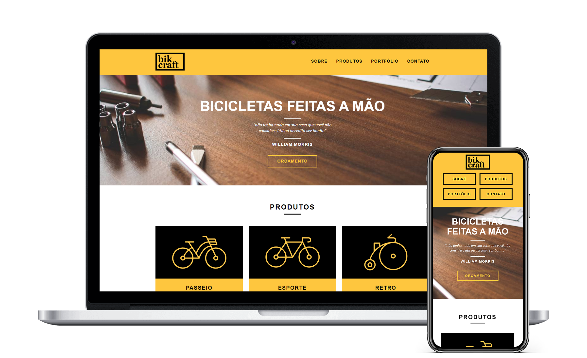

<h1 align="center">
   
</h1>

   <a href="#-projeto">Projeto</a>&nbsp;&nbsp;&nbsp;|&nbsp;&nbsp;&nbsp;    
   <a href="#-tecnologias">Tecnologias</a>&nbsp;&nbsp;&nbsp;|&nbsp;&nbsp;&nbsp;
   <a href="#-layout">Layout</a>&nbsp;&nbsp;&nbsp;|&nbsp;&nbsp;&nbsp;

   

## 💡 Projeto

Bikcraft é um projeto desenvolvido no curso de Web Design da Origamid, com a intenção de ajudar uma empresa de bicicletas artesanais expandir sua marca e divulgar seus produtos.

## 🛠 Tecnologias

Esse projeto foi desenvolvido utilizando:

* [HTML5](https://developer.mozilla.org/pt-BR/docs/Web/HTML/HTML5)
* [CSS](https://developer.mozilla.org/pt-BR/docs/Web/CSS)
* [JavaScript](https://developer.mozilla.org/pt-BR/docs/Web/JavaScript)

## 📋 Layout

Wireframe e Design desenvolvido no Adobe XD disponíveis abaixo:

* [Wireframe](https://xd.adobe.com/view/f189d9ee-5e17-42e0-4e70-d9de371e4588-87b8/) 
* [Design](https://xd.adobe.com/view/ca6958ac-4c7f-467d-4f82-428927607a9e-bc58/) 

